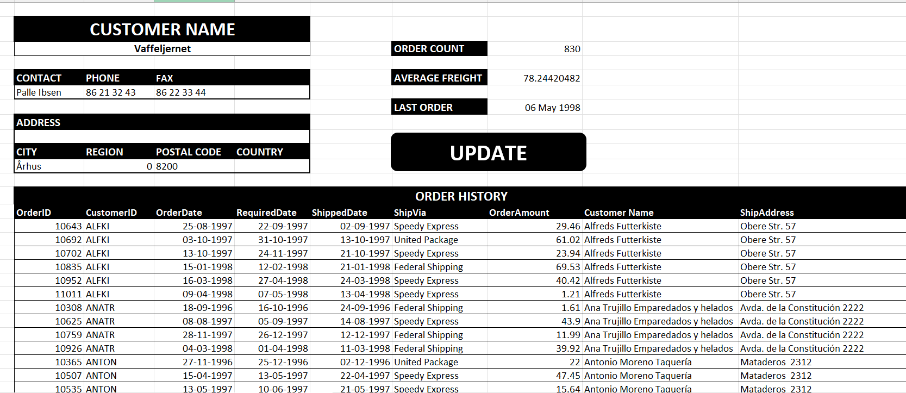

# Customer Order Dashboard

## Project Overview

This project focuses on building a **customer analytics dashboard** using a structured dataset containing company and contact information.

The dashboard helps businesses understand their customers, geographic distribution, and relationship data for better decision-making.

---

## 📊 Dashboard Preview

  

# Dataset Information

**File:** `Customer_Analytics.xlsm`

The dataset includes **91 customer records** with company details and contact information.

## Features

| Column | Description |
|------|-------------|
| Company Name | Name of the company |
| Customer ID | Unique identifier for the customer |
| Contact Name | Person responsible for communication |
| Contact Title | Role of the contact person |
| Address | Company address |
| City | City location |
| Region | Regional classification |
| Postal Code | Area postal code |
| Country | Country of the customer |
| Phone | Contact phone number |
| Fax | Fax number |

---

# Dashboard Objectives

- Understand customer distribution  
- Identify major business locations  
- Organize company contact information  
- Support sales and marketing teams  
- Improve customer relationship management  

---

# Possible Dashboard Insights

The dashboard can show:

## Geographic Insights

- Customers by country  
- Customers by city  
- Regional distribution  

## Business Insights

- Number of companies  
- Contact roles  
- Communication channels  

## Operational Insights

- Key business regions  
- Customer density  
- Relationship mapping  

---

# Tools Used

- Microsoft Excel  
- Data Cleaning  
- Pivot Tables  
- Dashboard Design  
- Business Intelligence Concepts  

---

# Example Dashboard Components

- Customer distribution map  
- Company count by country  
- Contact role breakdown  
- Regional analysis charts  
- Customer database table  

---

# Business Value

This dashboard helps organizations:

- Track customer information efficiently  
- Improve sales strategy  
- Identify target markets  
- Maintain structured business contacts  

---

# Author

**Tharun Kumar S**  
AI & Data Science Engineer  
Data Analytics | Business Intelligence | Machine Learning  

---

